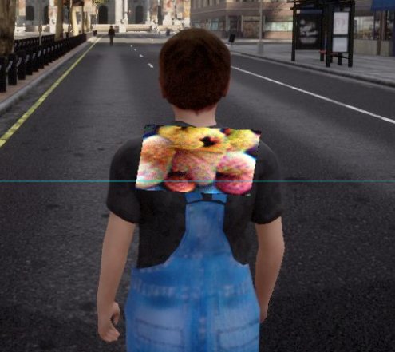
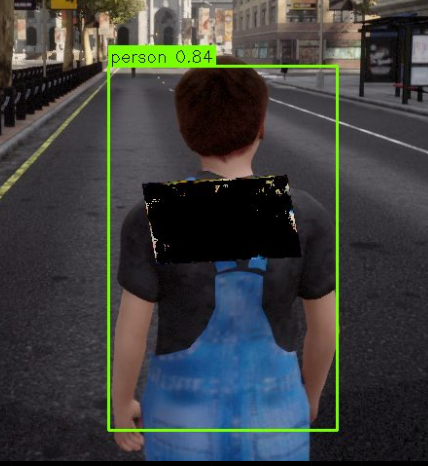

# AdverShield 🛡️

> **对抗补丁防御系统** — 基于 APDS 算法的实时对抗样本检测与净化平台，支持摄像头实时流与 Carla 自动驾驶仿真双模式。

---

## 项目简介

AdverShield 是一个面向对抗样本攻防研究的可视化演示平台。系统可以：

- 实时接收摄像头视频流或 Carla 仿真摄像头帧
- 向检测目标（行人）动态叠加对抗补丁（Adversarial Patch）
- 使用 **APDS（Adversarial Patch Detectors on segment）** 算法检测并净化对抗补丁
- 使用 YOLO 系列模型进行行人目标检测
- 在 Carla 仿真场景中演示：**贴补丁的行人无法被识别 → 车辆不停 → 启用 APDS 净化 → 识别到行人 → 车辆自动刹车**

---

## 演示效果

```
自动驾驶 + 补丁叠加 + APDS 关闭
  → YOLO 被欺骗，检测不到人 → 车辆继续前进 ✅

自动驾驶 + 补丁叠加 + APDS 开启
  → APDS 去除补丁 → YOLO 检测到人 → 车辆自动紧急刹车 🛑
```

---

## 系统架构

```
┌─────────────────────────────────────────────────────────────────┐
│                         浏览器前端                               │
│   WebRTC 摄像头 / Carla 帧显示 | 控制面板 | 实时检测结果         │
└────────────────────────┬────────────────────────────────────────┘
                         │ Socket.IO / WebSocket
┌────────────────────────▼────────────────────────────────────────┐
│                    main.py（Python 3.10）                        │
│   FastAPI + Socket.IO | YOLO 推理 | APDS 净化 | 补丁叠加          │
└────────────────────────┬────────────────────────────────────────┘
                         │ HTTP + WebSocket（端口 7100）
┌────────────────────────▼────────────────────────────────────────┐
│                carla_server.py（Python 3.7）                     │
│   Carla 场景管理 | 摄像头帧推送 | 车辆控制 | 紧急刹车接口         │
└────────────────────────┬────────────────────────────────────────┘
                         │ Carla Client API（端口 2000）
┌────────────────────────▼────────────────────────────────────────┐
│              Carla 仿真器（Docker，端口 2000）                    │
│   Town10HD_Opt 地图 | Tesla Model3 | 前方 50m/100m 静止行人       │
└─────────────────────────────────────────────────────────────────┘
```

---

## APDS算法

**APDS** (Adversarial Patch Detectors on segment) 是一种基于深度学习的防御算法。它利用 **UNet** 架构，通过在 **APRICOT** 数据集（或其他 COCO 格式的对抗数据集）上进行语义分割训练，实现对图像中“对抗性补丁（Adversarial Patches）”的精准定位与识别。

该算法的核心目标是构建一个鲁棒的预处理层，能够从输入图像中区分出“干净区域”与“被恶意修改的对抗区域”，从而为后续的目标检测（如 Faster R-CNN）提供安全保障。

### 🚀 核心特性

- **对抗补丁识别**：将对抗攻击检测任务转化为二值分割任务，实现像素级的识别。
- **混合训练策略**：支持通过 `p_clean` 参数灵活调整数据集中干净图像与对抗图像的比例，增强模型的区分能力。
- **双重验证机制**：在训练过程中同时监控干净数据集（Clean）和对抗数据集（Adv）上的性能（Dice 系数或交叉熵）。
- **动态学习率优化**：使用 `ReduceLROnPlateau` 调度器，根据验证集的加权表现自动调整学习率。
- **高度可配置**：支持自定义补丁大小、图像尺寸、基础滤波器数量等超参数。

------

### 🛠️ 算法流程

1. **数据输入**：读取包含对抗补丁的图像。

2. **特征提取**：通过 UNet 的 Encoder 部分提取多尺度特征。

3. **特征融合**：利用 Skip-connections 将低级空间信息与高级语义信息结合。

4. **分割输出**：生成与原图尺寸相同的 Mask，标注出对抗补丁存在的区域。

5. **损失计算**：

   - 对于二分类任务（n_classes=1）：使用 `BCEWithLogitsLoss`。

   - 对于多分类任务：使用 `CrossEntropyLoss`。

### 演示效果



调用APDS算法




### 📂 项目结构

```
.
├── dataset.py          # 自定义 COCODataset，支持 patch 注入逻辑
├── unet/               # UNet 模型架构实现
├── train_apds.py            # 主训练脚本 
├── eval.py             # 模型评估逻辑 (Dice Coeff / Loss)
├── predict.py          # 推理与可视化脚本
└── runs/               # 训练日志、检查点与可视化结果
```

## 环境依赖

### Python 环境说明

本项目需要**两个独立的 Python 环境**，因为 Carla 客户端库仅支持 Python 3.7，而推理框架需要 Python 3.10+。

| 环境 | Python 版本 | 用途 |
|------|-------------|------|
| `AdverShield`（主环境） | 3.10+ | main.py、YOLO、APDS、FastAPI |
| `carla_37`（Carla 环境） | 3.7 | carla_server.py、Carla 客户端 |

### Python 3.10 依赖（主环境）

```bash
pip install -r requirements.txt
```

或者

```
conda env create -f AdverShield_env.yaml
```

### Python 3.7 依赖（Carla 环境）

```bash
conda create -f carla_37_env.yaml
```

### Carla 仿真器

Carla 仿真器本体需单独下载（约 12GB）：

```
https://github.com/carla-simulator/carla/releases/tag/0.9.13
```

本项目使用 Docker 运行 Carla：

```bash
docker pull carlasim/carla:0.9.13
```

---

## 模型权重

以下权重文件需自行准备，放置于 `models/` 目录：

| 文件 | 说明 |
|------|------|
| `models/yolo2.weights` | YOLOv2 预训练权重 |

YOLO v8/v5 系列权重（`yolov8n.pt` 等）会在首次运行时由 ultralytics 自动下载。

---

## 快速开始

### 第一步：启动 Carla 仿真器

```bash
docker run --privileged --gpus all \
  --net=host \
  -it carlasim/carla:0.9.13 \
  ./CarlaUE4.sh -opengl -RenderOffScreen
```

### 第二步：启动 Carla 服务（Python 3.7 环境）

```bash
conda activate carla_37
cd /path/to/AdverShield
python carla_server.py
```

启动成功后监听 `http://0.0.0.0:7100`，并自动连接仿真器、生成场景（车辆 + 前方 50m/100m 各一个行人）。

### 第三步：启动主服务（Python 3.10 环境）

```bash
conda activate AdverShield
cd /path/to/AdverShield
python main.py
```

服务启动后监听 `http://0.0.0.0:8000`。

### 第四步：打开浏览器

访问 `http://localhost:8000`


---

## 功能使用说明

### 摄像头模式

1. Header 处选择 **摄像头** 模式
2. 点击 **◉ 开始检测** 授权摄像头
3. 在右侧面板上传对抗补丁图片，开启**图片叠加**
4. 开启 **APDS 净化**，观察净化前后的检测差异

### Carla 仿真模式

1. Header 处切换到 **Carla仿真** 模式
2. 在右侧 Carla 控制面板填写服务器地址（默认 `127.0.0.1`），点击**连接仿真器**
3. 连接成功后画面自动显示车载摄像头视角
4. 点击**自动前进**，车辆开始向前行驶
5. 开启**图片叠加**将对抗补丁贴到行人身上
6. 此时 YOLO 被欺骗，检测不到行人，车辆不停
7. 开启 **APDS净化**，净化后 YOLO 识别到行人，车辆自动紧急刹车

### 手动驾驶控制

| 操作 | 键盘 | 按钮 |
|------|------|------|
| 前进 | `W` 或 `↑` | ▲ |
| 刹车/后退 | `S` 或 `↓` | ▼ / ■ |
| 左转 | `A` 或 `←` | ◀ |
| 右转 | `D` 或 `→` | ▶ |

---

## 支持的检测模型

| 模型 | 说明 |
|------|------|
| YOLOv8n/s/m/l/x | Ultralytics YOLOv8 系列 |
| YOLOv5n/s/m | Ultralytics YOLOv5 系列 |
| YOLOv2 | 自定义 YOLOv2 实现 |

---

## 端口说明

| 端口 | 服务 | 说明 |
|------|------|------|
| 2000 | Carla 仿真器 | Carla 原生通信端口，固定不变 |
| 7100 | carla_server.py | Carla 桥接服务，供 main.py 调用 |
| 8000 | main.py | 主服务，浏览器访问入口（HTTP） |


## 技术栈

| 层次 | 技术 |
|------|------|
| 前端 | HTML5 / CSS3 / JavaScript / Socket.IO / WebRTC |
| 后端 | FastAPI / Python-SocketIO / Uvicorn / aiohttp |
| 推理 | PyTorch / Ultralytics YOLO / OpenCV |
| 仿真 | Carla 0.9.13 / Docker |
| 防御算法 | APDS（Adversarial Patch Detectors on segment） |
